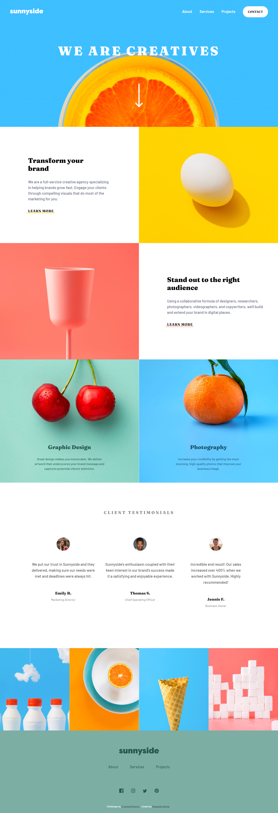

# Frontend Mentor - Sunnyside agency landing page solution

This is a solution to the [Sunnyside agency landing page challenge on Frontend Mentor](https://www.frontendmentor.io/challenges/sunnyside-agency-landing-page-7yVs3B6ef).

## Table of contents

- [Overview](#overview)
  - [The challenge](#the-challenge)
  - [Screenshot](#screenshot)
  - [Links](#links)
- [Built with](#built-with)
- [Author](#author)

## Overview

### The challenge

Users should be able to:

- View the optimal layout for the site depending on their device's screen size
- See hover states for all interactive elements on the page

### Screenshot

### Links

- Solution URL: [Frontent Mentor](https://www.frontendmentor.io/solutions/sunnyside-agency-landing-page-html-css-and-js-XPLdGOXKf)
- Live Site URL: [Netlify](https://sunnyside-freelance-agency-landing-page.netlify.app/)

## Built with

- Semantic HTML5 markup
- CSS custom properties
- SASS
- Flexbox
- CSS Grid
- Mobile-first workflow

## Author

- GitHub - [@shaqeebakhtar](https://github.com/shaqeebakhtar)
- Frontend Mentor - [@shaqeebakhtar](https://www.frontendmentor.io/profile/shaqeebakhtar)
- Instagram - [@shaqeeb_designs](https://www.twitter.com/shaqeeb_designs)